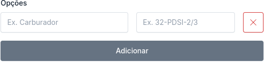
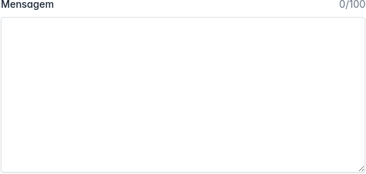
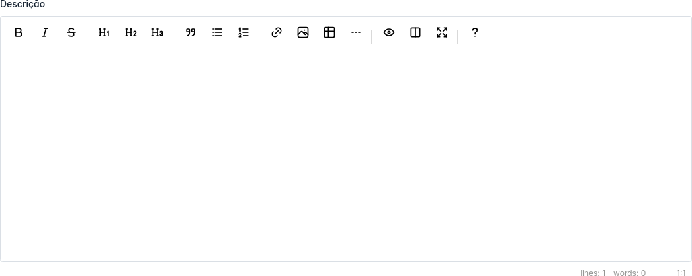

<p align="center"><a href="https://fmd.ag" target="_blank"></a></p>

<p align="center">
<a href="https://packagist.org/packages/agenciafmd/admix-ui"></a>
<a href="https://packagist.org/packages/agenciafmd/admix-ui"></a>
<a href="https://packagist.org/packages/agenciafmd/admix-ui"></a>
</p>

## Acesso rápido

- [Instalação](#instalação)
- [Formulário](#formulário)
    - [Input](#input)
    - [Number](#number)
    - [Email](#email)
    - [Password](#password)
    - [KeyValue](#keyvalue)
    - [IconValue](#iconvalue)
    - [Datetime / Date / Time](#datetime--date--time)
    - [Select](#select)
    - [TomSelect](#tomselect)
    - [Textarea](#textarea)
    - [Easymde](#easymde)
    - [Plain Text](#plain-text)
    - [Toggle / Multi Toggle](#toggle)
    - [Radio](#radio)
    - [Checkbox](#checkbox)
- [Página](#página)
    - [Form](#form)
- [UI](#ui)
    - [Card](#card)
    - [Card sem header](#card-sem-header)
- [Contribuindo](#contribuindo-com-o-projeto)
- [Licença](#licença)

## Instalação

```bash
composer install agenciafmd/admix-ui:v11.x-dev
```

## Formulário


```html

<x-form>
    <div class="mb-3">
        <x-form.input
                name="form.name"
                label="Nome"
        />
    </div>
    <div class="mb-3">
        <x-form.textarea
                name="form.message"
                label="Mensagem"
                maxlength=100
        />
    </div>
    <div class="mb-3">
        @php
        $options = [
            [
                'value' => '',
                'label' => '-'
            ],
            [
                'value' => 1,
                'label' => 'Item01'
            ],
            [
                'value' => 2,
                'label' => 'Item02'
            ],
            [
                'value' => 3,
                'label' => 'Item03 (desabilitada)',
                'disabled' => true
            ]
        ];
        @endphp
        <x-form.select
                name="form.select"
                label="Select"
                :options="$options"
        />
    </div>
</x-form>
```

### Input


```html

<div class="mb-3">
    <x-form.input
            name="form.name"
            label="Nome"
    />
</div>
<div class="mb-3">
    <x-form.input
            name="form.name"
            label="Nome"
            hint="Preencha com seu nome completo"
    />
</div>
```

### Number


```html

<div class="mb-3">
    <x-form.number
            name="form.number"
            label="Quantidade"
            hint="de 0 a 100"
    />
</div>
```

### Email


```html

<div class="mb-3">
    <x-form.email
            name="form.email"
            label="E-mail"
    />
</div>
```

### Password


```html

<div class="mb-3">
    <x-form.password
            name="form.password"
            label="Senha"
    />
</div>
<div class="mb-3">
    <x-form.password
            name="form.password"
            label="Senha"
            hint="Utilize pelo menos 1 letra maiúscula e caracteres especiais"
    />
</div>
```

### KeyValue



```html

<div class="mb-3">
    <x-form.key-value
            name="form.options"
            label="Opções"
            key-placeholder="Ex. Carburador"
            value-placeholder="Ex. 32-PDSI-2/3"
    />
</div>
```

### IconValue


```html

<div class="mb-3">
    <x-form.icon-value
            name="form.options"
            label="Opções"
            value-placeholder="Ex. Garagem"
    />
</div>
```

### Datetime / Date / Time


```html

<div class="mb-3">
    <x-form.datetime
            name="form.published_at"
            label="Data e hora de publicação"
    />
</div>
<div class="mb-3">
    <x-form.date
            name="form.published_at"
            label="Data de publicação"
    />
</div>
<div class="mb-3">
    <x-form.time
            name="form.published_at"
            label="Hora de publicação"
    />
</div>
```

### Select


```html

<div class="mb-3">
    @php
    $options = [
        [
            'value' => '',
            'label' => '-'
        ],
        [
            'value' => 1,
            'label' => 'São Paulo'
        ],
        [
            'value' => 2,
            'label' => 'Rio de Janeiro',
            'disabled' => true
        ]
    ];
    @endphp
    <x-form.select
            label="Estados"
            name="form.state"
            :options="$options"
    />
</div>
```

### TomSelect


```html

<div class="mb-3">
    @php
    $options = [
        [
            'value' => '',
            'label' => '-'
        ],
        [
            'value' => 1,
            'label' => 'Envelope',
            'custom-property' => '<span></span>',
        ],
        [
            'value' => 2,
            'label' => 'Cup Hot',
            'custom-property' => '<span></span>',
        ],
        [
            'value' => 3,
            'label' => 'Boombox',
            'custom-property' => '<span></span>',
            'disabled' => true
        ]
    ];
    @endphp
    <x-form.tom-select
            label="Estados"
            name="form.state"
            :options="$options"
    />
</div>
```

### Textarea



```html

<div class="mb-3">
    <x-form.textarea
            name="form.message"
            label="Mensagem"
            maxlength=100
    />
</div>
```

### Easymde



```html

<div class="mb-3">
    <x-form.easymde
            name="form.description"
            label="Descrição"
    />
</div>
```

### Plain Text


```html

<div class="mb-3">
    <x-form.plaintext
            label="Status"
            value="Em processamento"
    />
</div>
<div class="mb-3">
    <x-form.plaintext
            label="Data de criação"
            value="18/11/2024 09:11:03"
    />
</div>
```

### Toggle


```html

<div class="mb-3">
    <x-form.label for="form.is_available">
        Disponível
    </x-form.label>
    <x-form.toggle
            name="form.is_available"
            :large="true"
            :label-on="__('Yes')"
            :label-off="__('No')"
    />
</div>
```

### Multi Toggle


```html

<div class="mb-3">
    <x-form.label for="form.payment_methods">
        Modalidades de Pagamento
    </x-form.label>
    @php
    $paymentMethods = [
        [
            'label' => 'Cartão de Crédito',
            'value' => 'credit_card',
        ],
        [
            'label' => 'Boleto Bancário',
            'value' => 'boleto',
        ],
        [
            'label' => 'PIX',
            'value' => 'pix',
        ],
        [
            'label' => 'Transferência Bancária',
            'value' => 'bank_transfer',
        ],
    ];
    @endphp
    @foreach($paymentMethods as $method)
    <x-form.toggle
            name="form.payment_methods"
            :label="$method['label']"
            :value="$method['value']"/>
    @endforeach
</div>
```

### Radio


```html

<div class="mb-3">
    <x-form.group label="Escolha o tipo de Imóvel:">
        <x-form.radio
                name="form.propertyType"
                label="Apartamento"
                value="apartamento"
        />
        <x-form.radio
                name="form.propertyType"
                label="Casa"
                value="casa"
        />
        <x-form.radio
                name="form.propertyType"
                label="Imóvel Comercial"
                value="imovel-comercial"
                hint="Selecione uma opção"
        />
    </x-form.group>
</div>
```

### Radio Inline


```html

<div class="mb-3">
    <x-form.group label="Escolha o tipo de Imóvel:">
        <x-form.radio
                name="form.propertyType"
                label="Apartamento"
                value="apartamento"
                inline
        />
        <x-form.radio
                name="form.propertyType"
                label="Casa"
                value="casa"
                inline
        />
        <x-form.radio
                name="form.propertyType"
                label="Imóvel Comercial"
                value="imovel-comercial"
                hint="Selecione uma opção"
                inline
                disabled
        />
    </x-form.group>
</div>
```

### Checkbox


```html

<x-form.checkbox name="form.terms" label="Concordo com os Termos de Uso"/>
```

### Multi Checkbox


```html

<div class="row">
    <div class="col-md-12 mb-3">
        <x-form.label for="role.differentials">
            Diferenciais
        </x-form.label>
        <div class="row col-md-12">
            @php
            $checkbox = [
                [
                    'label' => 'Playground',
                    'value' => 'playground',
                ],
                [
                    'label' => 'Área Gourmet',
                    'value' => 'gourmet_area',
                ],
                [
                    'label' => 'Espaço Pet',
                    'value' => 'pet_area',
                ],
                [
                    'label' => 'Academia',
                    'value' => 'gym',
                ],
                [
                    'label' => 'Portaria 24h',
                    'value' => 'concierge_24h',
                ],
                [
                    'label' => 'Alarme Monitorado',
                    'value' => 'monitored_alarm',
                ],
                [
                    'label' => 'Quadra Poliesportiva',
                    'value' => 'sports_court',
                ],
            ];
            @endphp
            <div class="col-md-3">
                @foreach($checkbox as $item)
                <x-form.checkbox
                        name="form.differentials"
                        :label="$item['label']"
                        :value="$item['value']"
                />
                @endforeach
            </div>
        </div>
    </div>
</div>
```

## Página

### Form

## UI

### Card

### Card sem header

## Contribuindo com o projeto

Para rodar o projeto localmente e contribuir com o desenvolvimento:

Inicie um projeto Laravel

```bash
composer create-project laravel/laravel:v11.x-dev ui
```

Clone o repositório no projeto (não esqueça de entrar nele com `cd ui`), dentro da pasta `packages/agenciafmd/admix-ui`

```bash
git clone git@github.com:agenciafmd/admix-ui.git packages/agenciafmd/admix-ui
```

Adicione o pacote no composer.json do projeto

```json
{
    ...
    "license": "MIT",
    <!--adicione-este-nó-->
    "repositories": {
        "agenciafmd/admix-ui": {
            "type": "path",
            "url": "packages/agenciafmd/admix-ui",
            "options": {
                "symlink": true
            }
        }
    },
    "require": {
        ...
        <!--adicione-o-pacote-->
        "agenciafmd/admix-ui": "*"
    },
    ...
}
```

Agora, fazemos um update no composer para que ele reconheça o pacote

```bash
composer update
```

Se tudo correu bem, a ide vai reconhecer o pacote e você já pode começar a contribuir.

## Licença

Este projeto é entregue sob a [Licença MIT](./LICENSE).
