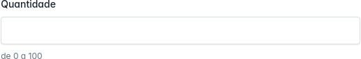
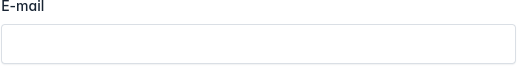
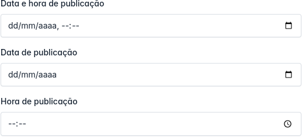

<p align="center"><a href="https://fmd.ag" target="_blank"></a></p>

<p align="center">
<a href="https://packagist.org/packages/agenciafmd/admix-ui"></a>
<a href="https://packagist.org/packages/agenciafmd/admix-ui"></a>
<a href="https://packagist.org/packages/agenciafmd/admix-ui"></a>
</p>

## Acesso rápido

- [Instalação](#instalação)
- [Formulário](#formulário)
    - [Input](#input)
    - [Number](#number)
    - [Email](#email)
    - [Password](#password)
    - [KeyValue](#keyvalue)
    - [Datetime / Date / Time](#datetime--date--time)
    - [Select](#select)
    - [Textarea](#textarea)
    - [Easymde](#easymde)
    - [Toggle / Multi Toggle](#toggle)
    - [Radio](#radio)
    - [Checkbox](#checkbox)
- [Página](#página)
    - [Form](#form)
- [UI](#ui)
    - [Card](#card)
    - [Card sem header](#card-sem-header)
- [Contribuindo](#contribuindo-com-o-projeto)
- [Licença](#licença)

## Instalação

```bash
composer install agenciafmd/admix-ui:v11.x-dev
```

## Formulário


```html

<x-form>
    <div class="mb-3">
        <x-form.input name="form.name" label="Nome" required/>
    </div>
    <div class="mb-3">
        <x-form.textarea name="form.message" label="Mensagem" maxlength=100 required/>
    </div>
    <div class="mb-3">
        @php
        $options = [
        [
        'value' => '',
        'label' => '-'
        ],
        [
        'value' => 1,
        'label' => 'Item01'
        ],
        [
        'value' => 2,
        'label' => 'Item02'
        ],
        [
        'value' => 3,
        'label' => 'Item03 (desabilitada)',
        'disabled' => true
        ]
        ];
        @endphp
        <x-form.select name="form.select" label="Select" :options="$options" required/>
    </div>
</x-form>
```

### Input


```html

<div class="mb-3">
    <x-form.input name="form.name" label="Nome" required/>
</div>
<div class="mb-3">
    <x-form.input name="form.name" label="Nome" hint="Preencha com seu nome completo"/>
</div>
```
### Number



```html
<div class="col-md-12 mb-3">
    <x-form.number name="form.number" label="Quantidade" hint="de 0 a 100"/>
</div>
```
### Email



```html
<div class="col-md-12 mb-3">
    <x-form.email name="form.email" label="E-mail"/>
</div>
```
### Password


```html

<div class="mb-3">
    <x-form.password name="form.password" label="Senha"/>
</div>
<div class="mb-3">
    <x-form.password name="form.password" label="Senha"
                     hint="Utilize pelo menos 1 letra maiúscula e caracteres especiais"/>
</div>
```
### KeyValue

```html
<div class="col-md-12 mb-3">
    <x-form.key-value name="form.additional"
        :label="__('local-lines::fields.additional')"
        key-placeholder="Ex. Carburador"
        value-placeholder="Ex. 32-PDSI-2/3"
    />
</div>
```
### Datetime / Date / Time



```html

<div class="mb-3">
    <x-form.datetime name="form.published_at" label="Data e hora de publicação"/>
</div>
<div class="mb-3">
    <x-form.date name="form.published_at" label="Data de publicação"/>
</div>
<div class="mb-3">
    <x-form.time name="form.published_at" label="Hora de publicação"/>
</div>
```

### Select


```html

<div class="mb-3">
    @php
    $options = [
    [
    'value' => '',
    'label' => '-'
    ],
    [
    'value' => 1,
    'label' => 'São Paulo'
    ],
    [
    'value' => 2,
    'label' => 'Rio de Janeiro',
    'disabled' => true
    ]
    ];
    @endphp
    <x-form.select label="Estados" name="form.state" :options="$options"/>
</div>
```

### Textarea


```html
<div class="mb-3">
    <x-form.textarea name="form.message" label="Mensagem" maxlength=100 required/>
</div>
```
### Easymde

```html
<div class="col-md-12 mb-3">
  <x-form.easymde name="form.description" label="Descrição"/>
</div>
```
### Toggle

```html
<div class="col-md-6 mb-3">
    <x-form.label for="form.is_available">
        {{ __('Available') }}
    </x-form.label>
    <x-form.toggle 
        name="form.is_available"
        :large="true"
        :label-on="__('Yes')"
        :label-off="__('No')"
    />
</div>
```
### Multi Toggle

```html
<div class="col-md-12 mb-3">
    <div class="col-md-12 mb-3">
       <x-form.label for="business.payment_methods">
        Modalidades de Pagamento
       </x-form.label>
       <div class="row col-md-12">
        @php
            $paymentMethods = [
                ['name' => 'Cartão de Crédito', 'value' => 'credit_card'],
                ['name' => 'Boleto Bancário', 'value' => 'boleto'],
                ['name' => 'PIX', 'value' => 'pix'],
                ['name' => 'Transferência Bancária', 'value' => 'bank_transfer'],
            ];
        @endphp
        <div class="col-md-3">
            @foreach($paymentMethods as $method)
                <x-form.toggle name="form.payment_methods"
                    :label="$method['name']"
                    :value="$method['value']"/>
            @endforeach
        </div>
       </div>
    </div>
</div>
```
### Radio


```html
<div class="mb-3">
  <x-form.group label="Escolha o Tipo de Imóvel:">
    <x-form.radio name="propertyType" label="Apartamento" value="apartamento"/>
    <x-form.radio name="propertyType" label="Casa" value="casa"/>
    <x-form.radio name="propertyType" label="Imóvel Comercial" value="imovel-comercial" hint="Selecione uma opção"/>
  </x-form.group>
</div>
<div class="mb-3">
  <x-form.group label="Escolha o Tipo de Imóvel:">
    <x-form.radio name="propertyType" label="Apartamento" value="apartamento"  inline/>
    <x-form.radio name="propertyType" label="Casa" value="casa"  inline/>
    <x-form.radio name="propertyType" label="Imóvel Comercial" value="imovel-comercial" hint="Selecione uma opção" inline disabled/>
  </x-form.group>
</div>
```

### Checkbox

```html
<x-form.checkbox name="form.terms" label="Concordo com os Termos de Uso"/>
```
### Multi Checkbox

```html
<div class="row">
    <div class="col-md-12 mb-3">
        <x-form.label for="role.differentials">
            Diferenciais
        </x-form.label>
        <div class="row col-md-12">
            @php
                $checkbox = [
                    ['name' => 'Playground', 'value' => 'playground'],
                    ['name' => 'Área Gourmet', 'value' => 'gourmet_area'],
                    ['name' => 'Espaço Pet', 'value' => 'pet_area'],
                    ['name' => 'Academia', 'value' => 'gym'],
                    ['name' => 'Portaria 24h', 'value' => 'concierge_24h'],
                    ['name' => 'Alarme Monitorado', 'value' => 'monitored_alarm'],
                    ['name' => 'Quadra Poliesportiva', 'value' => 'sports_court'],
                ];
            @endphp
            <div class="col-md-3">
                @foreach($checkbox as $item)
                    <x-form.checkbox name="form.differentials"
                                    :label="$item['name']"
                                    :value="$item['value']"
                    />
                @endforeach
            </div>
        </div>
    </div>
</div>
```
## Página

### Form

## UI

### Card

### Card sem header

## Contribuindo com o projeto

Para rodar o projeto localmente e contribuir com o desenvolvimento:

Inicie um projeto Laravel

```bash
composer create-project laravel/laravel:v11.x-dev ui
```

Clone o repositório no projeto (não esqueça de entrar nele com `cd ui`), dentro da pasta `packages/agenciafmd/admix-ui`

```bash
git clone git@github.com:agenciafmd/admix-ui.git packages/agenciafmd/admix-ui
```

Adicione o pacote no composer.json do projeto

```json
{
    ...
    "license": "MIT",
    <!--adicione-este-nó-->
    "repositories": {
        "agenciafmd/admix-ui": {
            "type": "path",
            "url": "packages/agenciafmd/admix-ui",
            "options": {
                "symlink": true
            }
        }
    },
    "require": {
        ...
        <!--adicione-o-pacote-->
        "agenciafmd/admix-ui": "*"
    },
    ...
}
```

Agora, fazemos um update no composer para que ele reconheça o pacote

```bash
composer update
```

Se tudo correu bem, a ide vai reconhecer o pacote e você já pode começar a contribuir.

## Licença

Este projeto é entregue sob a [Licença MIT](./LICENSE).
